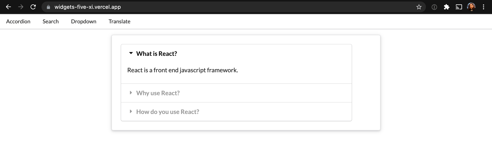
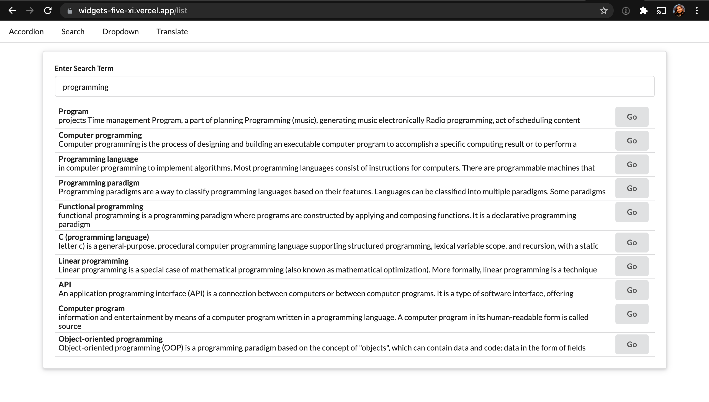
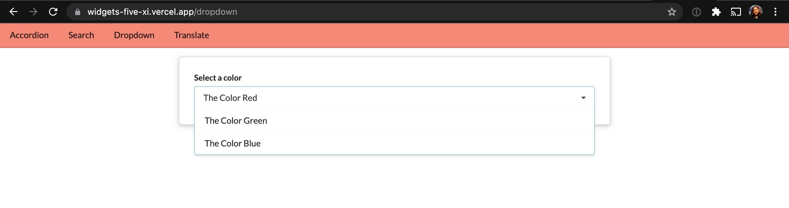
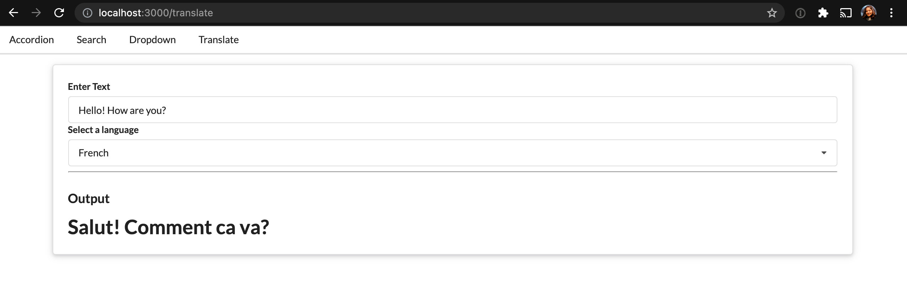

# [Live App Link](https://widgets-five-xi.vercel.app)

React app implementing navigation using React Router.

## Tools Used

- react-js [[Ref]](https://reactjs.org/docs/getting-started.html)
- Wikipedia API [[Ref]](https://en.wikipedia.org/w/api.php)
- Google Cloud Translation API [[Ref]](https://cloud.google.com/translate/docs/reference/rest/v2/translate)
- Semantics UI (_for CSS_) [[Ref]](https://semantic-ui.com/introduction/getting-started.html)

## Running the project

In the project directory, you can run:

### `npm start`

Runs the app in the development mode. 
Open [http://localhost:3000](http://localhost:3000) to view it in the browser.

The page will reload if you make edits. 
You will also see any lint errors in the console.

## Usage

1. The first widget shows a set of questions. Click on any question to expand.
2. The second widget shows a Wikipedia search. Enter any term in the search field to get top 10 results from Wikipidea. Hit 'Go' to visit subsequent Wikipidea pages.
3. The third widget shows a dropdown list that displays a list of colors. Selecting a relevant color changes the menu bar's background color.
4. The fourth widget has Google translate functionality. Enter a text to be translated, and choose a language from the dropdown. The translated text is shown in the 'Output'.

#### Credits

Stephen Grider [Modern React with Redux](https://www.udemy.com/course/react-redux/)
